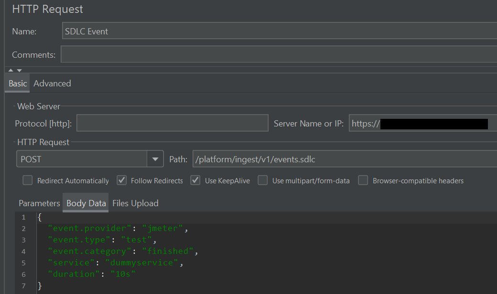
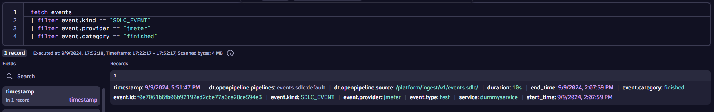

## x-dynatrace-test Headers

> Note: You won't see these values (or any traffic in Dynatrace) by default
> because the load test is hitting `example.com`
>
> If you have a service instrumented with OneAgent or OpenTelemetry, modify `example.jmx` to hit your URL instead to see traffic.

Open [jmeterscripts/example.jmx](https://github.com/Dynatrace/obslab-jmeter/blob/main/jmeterscripts/example.jmx){target=_blank} and notice a few things:

- The load test calls `example.com` and specifies an `x-dynatrace-test` headers with these values:

```
SI=jmeter;LSN=Scenario1;TSN=Step1;LTN=Demo LoadTest 1
```

These values help arrange and organize your load testing across multiple scenarios, steps and load test names.
      
The definition of these values (and additional values) can be found [here](https://docs.dynatrace.com/docs/platform-modules/automations/cloud-automation/test-automation#tag-tests-with-http-headers){target=_blank}.

## Tear Down Thread Group
A `tearDown` thread group exists (which fires at the end of the load test)

  - This request is a `POST` to `/platform/ingest/v1/events.sdlc` with a JSON payload
  - The request has header values set for `Content-Type` and `Authorization`

This event allows integration opportunitities into other Dynatrace functionality such as triggering workflows automatically at the end of a load test.

## Run JMeter

In the codespace terminal, paste the following:

```
apache-jmeter/bin/jmeter.sh -n -t jmeterscripts/example.jmx
```

## View Events

When the load test finished, the [teardown thread group](https://github.com/Dynatrace/obslab-jmeter/blob/fc0700075d990c9b5c95a2a69a98a8bc015e256f/jmeterscripts/example.jmx#L47){target=_blank} sends a Software Delivery Lifecycle Event (SDLC) to Dynatrace.



Notice that the event contains metadata such as the `provider` and `service` which can be used for filtering in Dynatrace (see DQL below).

This event can be used as a trigger Dynatrace for workflows, synthetic tests, the site reliability guardian and more.

In Dynatrace:

* Press `ctrl + k` and search for `notebooks`
* Open an existing notebook or create a new one
* Add a new `DQL` section and paste the following

```
fetch events
| filter event.kind == "SDLC_EVENT"
| filter event.provider == "jmeter"
| filter event.category == "finished"
```



The demo is complete.

<div class="grid cards" markdown>
- [Click Here to Delete and Cleanup resources :octicons-arrow-right-24:](cleanup.md)